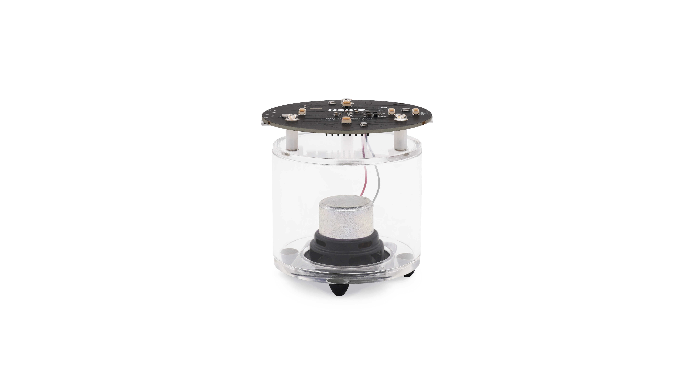

# YODAOS Kamino18

The `yodaos-kamino18` is to maintain the resources and configs for the following products:

- Kamino18 Devkit 3.0
- Kamino18 Devkit 3.3

And it can also be used as an sample of [YODAOS][]'s product.



### Directories

| path | description |
|------|-------------|
| [ota](./ota)          | This directory manages the partition table for system OTA. |
| [res](./res)          | The runtime resource directory. |
| [configs](./configs)  | [YODAOS][] uses [defconfig][] to manage which packages should be compiled. |
| [CMakeLists.txt][]    | The build script entry. |

### Build

Follow the steps below to compile the product v3.3:

```bash
$ cd openwrt
$ cp ../products/rokid/dev3.3/configs/leo_k18_dev33_defconfig .config
$ make defconfig && make
```

### License

Apache 2.0

[YODAOS]: https://github.com/yodaos-project/yodaos
[defconfig]: https://github.com/torvalds/linux/blob/master/arch/csky/configs/defconfig
[CMakeLists.txt]: ./CMakeLists.txt
